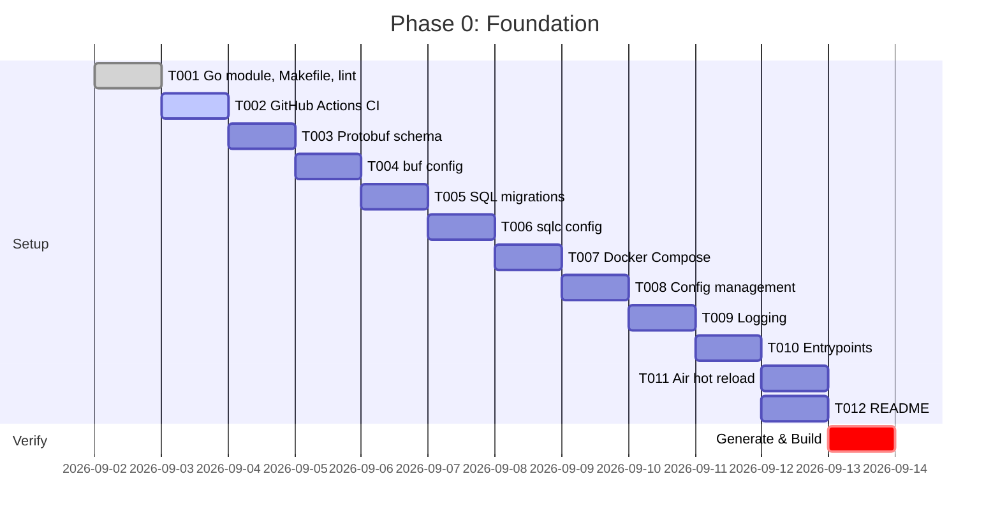

# Development Phases — Simple-VPN-Builder

> Each phase = 1-2 weeks for a solo developer. Phases are sequential but some tasks within a phase can be parallelized.

---

## Phase 0: Foundation (Week 1-2) — [COMPLETED]
**Goal**: Repo skeleton, CI, code generation pipeline, local dev stack

| Task | Description | Deliverable |
|---|---|---|
| T001 | Go module, Makefile, golangci-lint | `go.mod`, `Makefile`, `.golangci.yml` |
| T002 | GitHub Actions CI (build, test, lint) | `.github/workflows/ci.yml` |
| T003 | Protobuf schema (agent gRPC API) | `proto/agent/v1/agent.proto` |
| T004 | buf.yaml + buf.gen.yaml for codegen | `buf.yaml`, `buf.gen.yaml` |
| T005 | SQL migrations (initial schema) | `migrations/001_init.up.sql` |
| T006 | sqlc.yaml for type-safe DB access | `sqlc.yaml` |
| T007 | Docker Compose (Postgres, Redis, CP, Agent) | `docker/docker-compose.yml` |
| T008 | Config management (Viper + env) | `internal/shared/config/config.go` |
| T009 | Structured logging (slog + OTLP ready) | `internal/shared/logger/logger.go` |
| T010 | Entrypoints (empty but compiling) | `cmd/control-plane/main.go`, `cmd/agent/main.go` |
| T011 | Air config for hot reload | `.air.cp.toml`, `.air.agent.toml` |
| T012 | Basic README (public, not gitignored) | `README.md` |

**Exit Criteria**: `make generate && make build && make test` passes; `make dev-up` starts Postgres + Redis + empty CP + Agent

---

## Phase 1: Control Plane Core — Data Layer (Week 2-3) — [COMPLETED]
**Goal**: Database layer, migrations, type-safe queries, health checks

| Task | Description |
|---|---|
| T101 | PostgreSQL connection pool (pgx) with health checks |
| T102 | sqlc-generated queries for all tables (nodes, users, plans, credentials, traffic, admins, api_keys, audit_logs) |
| T103 | Migration runner (golang-migrate) integrated in CP startup |
| T104 | Repository pattern: `NodeRepo`, `UserRepo`, `PlanRepo`, `CredentialRepo`, `TrafficRepo`, `AdminRepo`, `APIKeyRepo` |
| T105 | Transaction helpers + context propagation |
| T106 | Unit tests with testcontainers (Postgres) for repos |

**Exit Criteria**: All repos tested, migrations apply cleanly, `make test` covers data layer

---

## Phase 2: Control Plane Core — Auth & API Framework (Week 3-4)
**Goal**: Authentication, middleware, OpenAPI-driven REST server

| Task | Description |
|---|---|
| T201 | JWT auth: access (15m) + refresh (7d) tokens, rotation, revocation |
| T202 | API Key auth: prefix+hash storage, scopes (read/write/admin), expiry |
| T203 | bcrypt/Argon2id for password hashing |
| T204 | TOTP 2FA for admins (optional, behind flag) |
| T205 | HTTP middleware: request ID, structured logging, recovery, rate limiting |
| T206 | OpenAPI 3.1 spec (`api/openapi.yaml`) with all endpoints |
| T207 | oapi-codegen → Chi server interfaces + types |
| T208 | Chi router setup with middleware chain |
| T209 | Error handling: RFC 7807 problem details |
| T210 | CORS, security headers, request size limits |

**Exit Criteria**: `POST /auth/login` returns JWT; `GET /nodes` protected by JWT/API Key; OpenAPI spec valid

---

## Phase 3: Control Plane — REST API Resources (Week 4-5)
**Goal**: Full CRUD for all resources via REST

| Task | Description |
|---|---|
| T301 | Nodes API: list, create, get, patch, delete, stats |
| T302 | Users API: list, create, get, patch, delete, reset-traffic, subscription |
| T303 | Plans API: list, create, get, patch, delete |
| T304 | Credentials API: list, create, get, patch, delete, rotate |
| T305 | Analytics API: traffic aggregate, per-user, per-node |
| T306 | Admin API: list, create, API Keys CRUD |
| T307 | Audit logging on all mutating endpoints |
| T308 | Pagination, filtering, sorting conventions |
| T309 | Input validation (validator.v10) on all handlers |
| T310 | Integration tests for all endpoints |

**Exit Criteria**: All REST endpoints functional, tested, documented in OpenAPI

---

## Phase 4: Control Plane — gRPC Agent Sync (Week 5-6)
**Goal**: Bidirectional gRPC streaming for agent communication

| Task | Description |
|---|---|
| T401 | mTLS setup: CA, cert generation, rotation (30d TTL) |
| T402 | gRPC server with `AgentService.Connect` bidirectional streaming |
| T403 | Agent registration: verify cert, store node record, assign config version |
| T404 | Config push: full config on connect, delta updates on changes |
| T405 | Config versioning (monotonic integer) + acknowledgment |
| T406 | Heartbeat handling: update `last_heartbeat`, track node status |
| T407 | Metrics ingestion: parse `MetricsReport` → upsert `traffic_stats` |
| T408 | Command channel: restart, reload, reboot via gRPC |
| T409 | Graceful stream handling: reconnection, backoff, ordering |
| T410 | Integration test: CP + 2 agents in Docker Compose |

**Exit Criteria**: Agent connects, receives config, sends heartbeats/metrics, CP pushes updates

---

## Phase 5: Node Agent — Core & WireGuard (Week 6-8)
**Goal**: Agent binary that manages WireGuard interfaces

| Task | Description |
|---|---|
| T501 | Agent gRPC client: mTLS dialer, cert reloading, reconnection with backoff |
| T502 | Registration flow: generate/reuse identity, register with CP |
| T503 | Config syncer: apply full config, handle delta updates atomically |
| T504 | WireGuard adapter: `GenerateServerConfig` → wg-quick + nftables rules |
| T505 | WireGuard adapter: `GenerateClientConfig` → `.conf` + QR code |
| T506 | Interface manager: create/up/down, peer add/remove/update via netlink |
| T507 | nftables/iptables: isolate peers, masquerade, persistent rules |
| T508 | Traffic accounting: per-peer counters via `wg` / netlink every 30s |
| T509 | Metrics collector → gRPC stream (PeerMetric) |
| T510 | Command executor: restart wg, reload config, reboot node |
| T511 | Health endpoint (`/healthz`) + graceful shutdown (SIGTERM) |
| T512 | Systemd service file + Dockerfile for agent |

**Exit Criteria**: Agent manages WireGuard peers, reports traffic, survives CP restart

---

## Phase 6: Xray Adapter (Week 8-9)
**Goal**: Second protocol adapter (VLESS-Reality, VMess, Trojan, Shadowsocks)

| Task | Description |
|---|---|
| T601 | Embed Xray core as library (`github.com/xtls/xray-core`) |
| T602 | Xray adapter: server config generation (JSON → Xray config) |
| T603 | Xray adapter: client config generation (subscription formats: clash, v2ray, sing-box, base64) |
| T604 | Reality: automated shortId/keys/cert generation |
| T605 | Xray process manager: single process, multiple inbounds, graceful reload |
| T606 | Xray metrics: Stats API (gRPC) or log parsing → PeerMetric |
| T607 | Adapter registration + config validation |
| T608 | Integration test: CP + Agent with WireGuard + Xray on same node |

**Exit Criteria**: Users get VLESS-Reality configs, traffic accounted, subscription links work

---

## Phase 7: Admin Web UI (Week 9-10)
**Goal**: Minimal but functional HTMX-based admin panel

| Task | Description |
|---|---|
| T701 | Go html/template + HTMX + Alpine.js setup |
| T702 | Layout: sidebar, topbar, toast notifications |
| T703 | Dashboard: node health, user count, traffic charts (Chart.js) |
| T704 | Nodes page: table, create/edit modal, real-time status |
| T705 | Users page: table, create/edit, traffic usage, subscription link (copy/QR) |
| T706 | Plans page: CRUD |
| T707 | Credentials page: per-user per-node, rotate keys |
| T708 | Admins page: list, create, API Keys management |
| T709 | Login page + JWT cookie handling (HttpOnly, Secure, SameSite) |
| T710 | Responsive, dark mode, accessibility basics |

**Exit Criteria**: Admin can manage entire system via browser without API client

---

## Phase 8: Subscription & Client Config Generation (Week 10)
**Goal**: Production-ready subscription links for all major clients

| Task | Description |
|---|---|
| T801 | Subscription link format: base64 JSON with metadata |
| T802 | Clash (YAML) generator |
| T803 | V2Ray / sing-box (JSON) generator |
| T804 | WireGuard `.conf` + QR code (PNG) |
| T805 | One-time subscription token (signed, expiring) |
| T806 | User-facing subscription page (no auth, token only) |
| T807 | Auto-detect best protocol per client capability |
| T808 | Documentation: how to import in each client app |

**Exit Criteria**: `GET /users/{id}/subscription` returns working config for Clash/V2Ray/SingBox/WireGuard

---

## Phase 9: Hardening & Observability (Week 11)
**Goal**: Production readiness

| Task | Description |
|---|---|
| T901 | Rate limiting (token bucket) on REST + gRPC |
| T902 | Prometheus metrics on CP + Agent (custom + go collector) |
| T903 | OpenTelemetry tracing (W3C trace-context) |
| T904 | Structured JSON logging + log levels via env |
| T905 | Health/readiness endpoints for k8s |
| T906 | Database backup/restore scripts |
| T907 | Chaos tests: network partition, CP restart, agent restart, cert rotation |
| T908 | Load test: 1000 users, 50 nodes, 10k peers |
| T909 | Security audit: secrets scanning, dependency check, penetration test basics |

**Exit Criteria**: Metrics in Prometheus, traces in Jaeger, survives chaos tests

---

## Phase 10: Release Automation & Documentation (Week 12) — [COMPLETED]
**Goal**: Ship it with automated release engineering, diagnostics, and open-source readiness

| Task | Description | Deliverable |
|---|---|---|
| T1001 | GoReleaser v2 multi-arch build, archives, checksums, nfpms | `.goreleaser.yaml` |
| T1002 | GitHub Actions release workflow (Cosign OIDC keyless, Syft SBOM) | `.github/workflows/release.yml` |
| T1003 | Universal 1-line curl installer with multi-distro auto-detect | `scripts/install.sh` |
| T1004 | Node Agent diagnostic self-check engine (doctor) | `internal/agent/doctor/`, `cmd/agent/main.go` |
| T1005 | Systemd service units with Linux capability sandboxing | `packaging/systemd/` |
| T1006 | Cloud-Init 1-click exit node template & Helm chart | `deploy/cloud-init/`, `deploy/helm/` |
| T1007 | Community health: YAML issue forms, PR template, Dependabot | `.github/` |
| T1008 | Complete docs: Architecture, Deployment, Migration, Dev, API | `docs/`, `LICENSE`, `README.md` |

**Exit Criteria**: `git tag v*.*.* && git push --tags` triggers GoReleaser + multi-arch Docker GHCR publish automatically; `scripts/install.sh` and `vpnbuilder-agent doctor` operational.

---

## Summary Timeline

| Phase | Weeks | Focus | Status |
|---|---|---|---|
| 0 | 1-2 | Foundation, tooling, dev stack | COMPLETED |
| 1 | 2-3 | Data layer, migrations, repos | COMPLETED |
| 2 | 3-4 | Auth, OpenAPI, middleware | COMPLETED |
| 3 | 4-5 | REST resources CRUD | COMPLETED |
| 4 | 5-6 | gRPC agent sync (mTLS) | COMPLETED |
| 5 | 6-8 | Agent core + WireGuard | COMPLETED |
| 6 | 8-9 | Xray adapter | COMPLETED |
| 7 | 9-10 | Admin Web UI (HTMX) | COMPLETED |
| 8 | 10 | Subscription generation | COMPLETED |
| 9 | 11 | Hardening, observability | COMPLETED |
| 10 | 12 | Release, packaging, docs | COMPLETED |

**Total: 12 weeks roadmap completed. Platform ready for production.**

---

## Phase 0 — Current Sprint Tasks (Detailed)

---

## Next Phase Preview (Phase 1)

After Phase 0 completes, Phase 1 starts with:
1. PostgreSQL connection pool with health checks
2. sqlc-generated queries for all 8 tables
3. Migration runner on CP startup
4. Repository implementations with testcontainers tests

This gives a solid, typed data layer before any business logic.