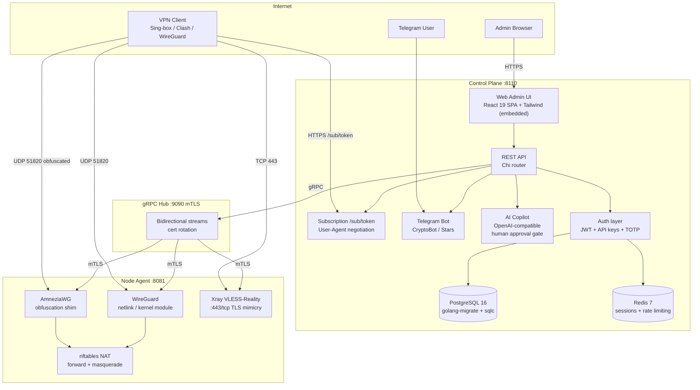

# Architecture

## Overview

I designed Simple VPN Builder around two separate binaries:

- **Control plane (`vpnbuilder-cp`)**: the central management server that hosts the REST API, the embedded React 19 web dashboard, the subscription delivery endpoint, the Telegram sales bot, the AI Copilot, and the gRPC hub.
- **Node agent (`vpnbuilder-agent`)**: a lightweight daemon running on each VPN server, managing WireGuard, AmneziaWG, and Xray VLESS-Reality through netlink and process supervisors.

The control plane and agents stay connected through a persistent bidirectional gRPC stream secured with mutual TLS (mTLS).

---

## System diagram

---

## Control plane subsystems

### REST API

I built the API on top of Chi. Every request requires either a JWT session token or an API key passed in headers. Role-based access control enforces three privilege tiers: `owner`, `superadmin`, and `admin`.

Route groups:

| Prefix | Purpose |
|---|---|
| `/api/v1/peers` | WireGuard peer CRUD |
| `/api/v1/nodes` | Node server management |
| `/api/v1/users` | User and subscription management |
| `/api/v1/billing` | Payments, orders, gateways |
| `/api/v1/ai` | AI Copilot queries and approvals |
| `/sub/{token}` | Dynamic subscription config delivery |
| `/admin/*` | Web admin UI (React 19 SPA and JSON data endpoints) |

### Web admin UI

I wrote the admin interface as a React 19 Single Page Application with Vite, Tailwind CSS v4, and Lucide icons. I bundle the production build into the Go binary using `embed.FS` (`internal/controlplane/web/dist`). The frontend communicates with dedicated JSON endpoints (`/admin/*-data`). If a fatal error occurs before the SPA mounts, Go serves a fallback `error.html` template.

### Database layer

I use PostgreSQL 16 with `golang-migrate` for versioned schema migrations and `sqlc` to generate type-safe Go queries. Connection pooling is handled by `pgx/v5`.

### Authentication

The system accepts three credential types:

| Type | Storage | Use case |
|---|---|---|
| JWT | Redis (session store and revocation list) | Admin web UI, short-lived tokens |
| API key | PostgreSQL (bcrypt hash) | External scripts, bot communication, automation |
| TOTP | PostgreSQL (encrypted seed) | Optional two-factor auth for admin accounts |

### AI Copilot

The control plane includes an optional AI Copilot that answers operational questions about your network. It has two modes:

- **Read queries**: answered using the built-in playbook and live cluster telemetry.
- **Mutations**: whenever an action modifies state (such as restarting a node or resetting traffic limits), the copilot creates a structured proposal and pauses. It will not run until an admin clicks Confirm in the web UI.

It works with any OpenAI-compatible provider. You configure it via `AI_ENDPOINT`, `AI_API_KEY`, and `AI_MODEL`. Only accounts with the Owner role can use the copilot by default.

---

## Node agent subsystems

### WireGuard engine

The agent configures WireGuard interfaces and peers directly through Linux netlink calls (using `vishvananda/netlink` and `wgctrl-go`). It does not shell out to the `wg` CLI, so peers can be added, updated, or removed without interrupting active connections.

### AmneziaWG

The agent supports AmneziaWG either via a patched kernel module or a userspace fallback. It configures the obfuscation headers (`Jc`, `Jmin`, `Jmax`, `S1`, `S2`, `H1` to `H4`) so DPI equipment cannot recognize standard WireGuard handshake patterns.

### Xray VLESS+Reality

The agent manages an embedded Xray-core process for VLESS with Reality. The traffic mimics real TLS 1.3 handshakes to an allowed public destination, bypassing SNI filters and deep packet inspection.

### nftables NAT

The agent manages `nftables` tables for packet forwarding and masquerade rules. It applies them when interfaces come up and tears them down cleanly on exit.

---

## Dynamic subscription delivery

When a client hits `/sub/{token}`, the handler checks the `User-Agent` header and dynamically formats the response for that specific app:

| User-Agent pattern | Returned format |
|---|---|
| `sing-box` | Sing-box JSON configuration |
| `clash` | Clash Meta YAML configuration |
| `wireguard` or empty | Standard WireGuard `.conf` text |
| `amneziavpn` | AmneziaVPN JSON bundle |
| other apps or browsers | Base64-encoded subscription list |

---

## Security model

- The control plane acts as its own internal Certificate Authority. Each node agent gets a signed client certificate during bootstrapping.
- Certificates rotate automatically. The agent re-authenticates on each rotation cycle without dropping tunnels.
- The AI Copilot cannot run mutating commands on its own: every destructive action requires manual human confirmation.
- Node agents run with minimal Linux capabilities (`CAP_NET_ADMIN`, `CAP_SYS_MODULE`) rather than full root access where possible.

---

## Ports reference

| Port | Protocol | Component | Direction |
|---|---|---|---|
| 8110 | TCP | Control plane | Inbound from users and admins |
| 9090 | TCP | gRPC hub | Inbound from node agents to control plane |
| 8081 | TCP | Node agent health | Inbound from local monitoring (`/healthz`) |
| 51820 | UDP | WireGuard and AmneziaWG | Inbound from VPN clients |
| 443 | TCP | Xray VLESS+Reality | Inbound from VPN clients |

---

## Zero-knowledge node isolation

Because exit nodes are often hosted on budget VPS providers, I designed the agent to operate without storing sensitive user records:

- **Pseudonymous identifiers**: nodes only know a random UUID and the peer's public key.
- **No identity on edge servers**: emails, usernames, billing data, and passwords are never sent to or stored on node servers.
- **Delta-only telemetry**: nodes report raw byte counters back to the control plane over gRPC. The control plane calculates totals and sends peer revocation commands when quotas run out.
- **Stateless agents**: if a node server is rebuilt or rebooted, it re-downloads all active peers from the control plane in seconds.
