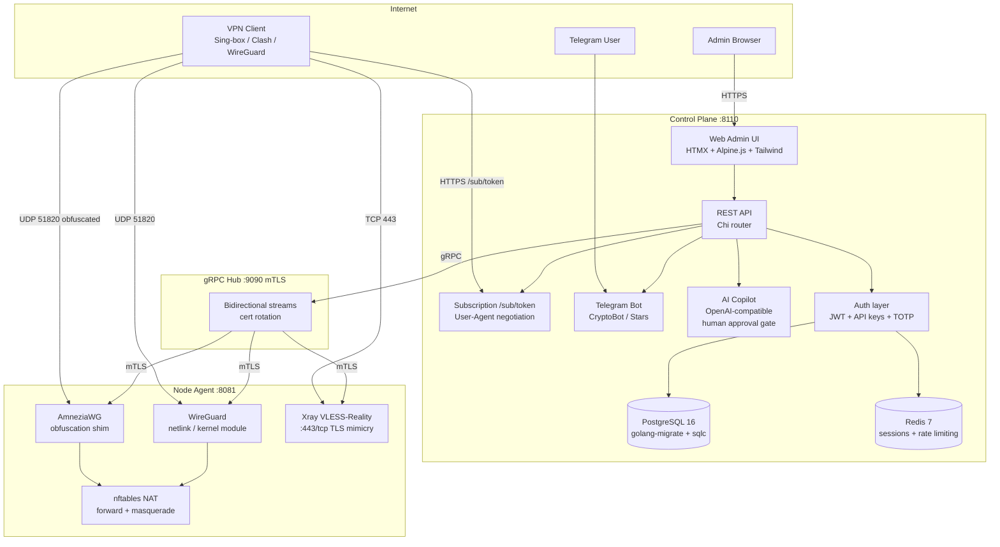
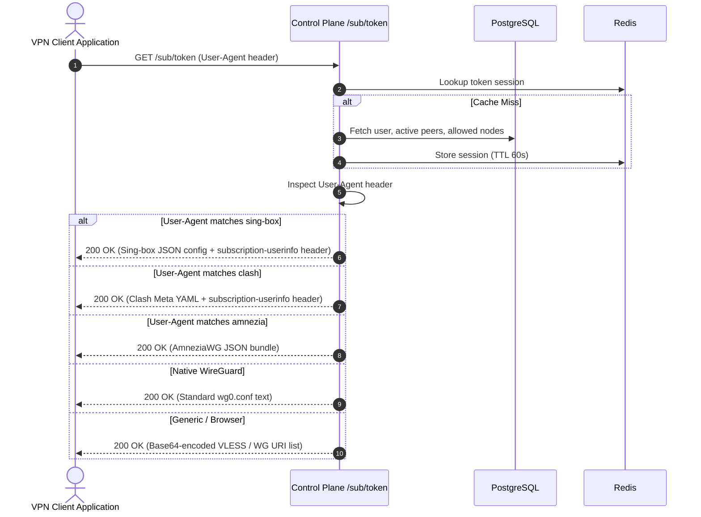

# Architecture

## Overview

Simple VPN Builder consists of two independently deployable binaries:

- **Control plane** — the central management server (REST API, web admin UI, subscription delivery, Telegram bot, AI Copilot, gRPC hub)
- **Node agent** — a lightweight daemon deployed on each VPN server (WireGuard/AmneziaWG, Xray VLESS-Reality, nftables NAT)

The control plane and agents communicate over a persistent bidirectional gRPC stream secured with mutual TLS.

---

## System diagram

---

## Control plane subsystems

### REST API

Built on the Chi router. All endpoints require either a JWT session token or a machine API key. Role-based access control enforces owner/admin/support permission levels.

Route groups:

| Prefix | Purpose |
|---|---|
| `/api/v1/peers` | WireGuard peer CRUD |
| `/api/v1/nodes` | Node server management |
| `/api/v1/users` | User and subscription management |
| `/api/v1/billing` | Payments, transactions |
| `/api/v1/ai` | AI Copilot query and approval |
| `/sub/{token}` | Subscription config delivery |
| `/admin/*` | Web admin UI (server-rendered) |

### Web admin UI

Server-rendered HTML templates (Go `html/template`) with HTMX for partial updates and Alpine.js for lightweight client state. Tailwind CSS for styling. No JavaScript build step required.

### Database layer

PostgreSQL 16 with `golang-migrate` for schema migrations and `sqlc` for type-safe query generation. Connection pool managed by `pgx/v5`.

### Authentication

Three credential types accepted:

| Type | Storage | Use case |
|---|---|---|
| JWT | Redis (session store) | Admin web UI, short-lived |
| API key | PostgreSQL (bcrypt hash) | External integrations, CI/CD |
| TOTP | PostgreSQL (encrypted seed) | Second factor for admin login |

### AI Copilot

Accepts natural language queries about the infrastructure. Two operation modes:

- **Read queries** — answered directly from the knowledge base (playbook + live system state)
- **Mutations** — generates a structured change proposal, pauses, waits for admin approval via a confirmation UI before executing

Connects to any OpenAI-compatible endpoint. Configured via `AI_ENDPOINT`, `AI_API_KEY`, `AI_MODEL`. Access restricted to owner role by default.

---

## Node agent subsystems

### WireGuard engine

Manages WireGuard interfaces and peers through the Linux netlink interface directly (no `wg` CLI dependency). Supports peer add/remove/update without restarting the interface.

### AmneziaWG

Runs AmneziaWG as a kernel module or userspace implementation depending on the kernel version. Adds junk packet obfuscation to make WireGuard traffic undetectable by DPI systems.

### Xray VLESS+Reality

Runs Xray-core as a subprocess. VLESS+Reality makes the traffic fingerprint identical to a real TLS connection to a legitimate site, defeating SNI-based blocking and traffic analysis.

### nftables NAT

Manages `nftables` rules for forward and masquerade. Applied automatically when peers are added or removed.

---

## Subscription delivery

The `/sub/{token}` endpoint reads the `User-Agent` header to determine the client app and returns the matching config format:

| User-Agent pattern | Returned format |
|---|---|
| `sing-box` | Sing-box JSON |
| `clash` | Clash YAML |
| `wireguard` / no UA | WireGuard .conf |
| `amneziavpn` | AmneziaVPN JSON |
| anything else | base64 encoded |

---

## Security model

- mTLS certificates for gRPC: the control plane acts as CA; each agent gets a signed client certificate
- Certificates rotate automatically; the agent reconnects and re-authenticates on each rotation cycle
- The AI Copilot never executes mutations autonomously; every structural change requires an explicit admin confirmation click
- Node agents run with the minimum Linux capabilities needed for WireGuard and nftables (`CAP_NET_ADMIN`, `CAP_SYS_MODULE`)

---

## Ports reference

| Port | Protocol | Component | Direction |
|---|---|---|---|
| 8110 | TCP | Control plane | Inbound from users and admins |
| 9090 | TCP | gRPC hub | Outbound from control plane to agents |
| 8081 | TCP | Node agent health | Inbound from monitoring |
| 51820 | UDP | WireGuard / AmneziaWG | Inbound from VPN clients |
| 443 | TCP | Xray VLESS+Reality | Inbound from VPN clients |

---

## Zero-Knowledge Edge Node Isolation

Edge servers operated by third-party hosting providers represent an operational risk if customer records are exposed. Simple VPN Builder implements strict zero-knowledge partitioning:

- **Pseudonymous Identifiers**: Edge nodes only store a cryptographic client UUID and a WireGuard public key.
- **No Identity Storage**: User emails, phone numbers, billing history, payment credentials, and access passwords never touch edge node storage.
- **Delta-Only Ingestion**: Nodes stream bandwidth counters (bytes sent / bytes received) to the control plane over gRPC. The control plane aggregates usage and sends atomic peer revocation commands when quotas or subscriptions expire.
- **Stateless Agent Operation**: If an edge node is wiped or restarted, its local state is rebuilt dynamically from the control plane over the mTLS gRPC connection.

---

## Subscription Delivery Flow

